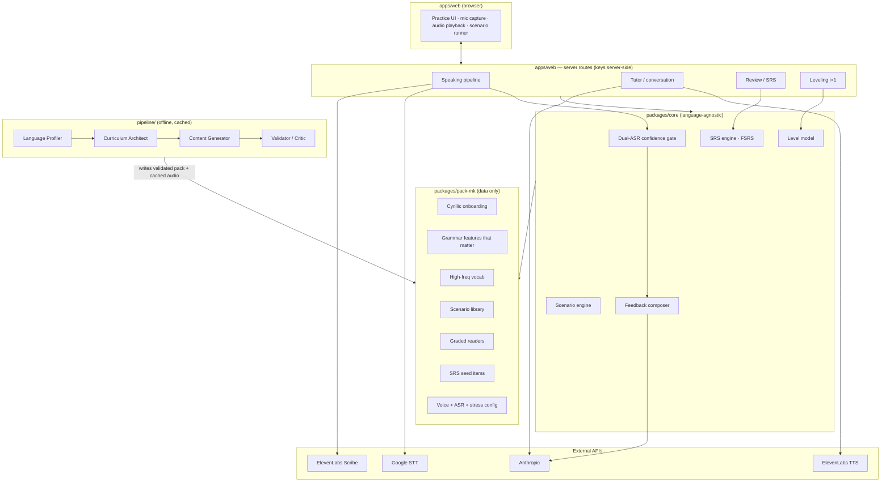

# Design & Architecture — Conversation-First Language Learning

> Macedonian-first, language-agnostic core. North star: **get from zero to holding simple, real
> conversations in Macedonian** — speaking and real-time listening are the product; vocab and
> grammar are supporting infrastructure. The first **benchmark** is a bar/café conversation
> (concrete, high-frequency, motivating — and social: the waiter *and* other patrons, not just
> ordering). It's a milestone, not the ceiling. **Two axes of generality, both data-driven:
> languages are packs, situations are scenarios** — neither is hardcoded in the engine.
>
> This document is the plan. It does **not** build features. Scaffold is described in §8 and
> generated on your go-ahead.

## 0. Grounding decisions (from the spike + your inputs)

- **Speaking-first is viable.** The spike proved ASR can give non-misleading beginner feedback
  for Macedonian **when gated by dual-engine agreement** (ElevenLabs Scribe + Google STT). When
  the engines agree → confident feedback; when they disagree → the tutor flags "likely ASR error"
  and hedges instead of marking correct speech wrong. This **dual-engine confidence gate** is a
  first-class part of the speaking subsystem, not an afterthought.
- **Budget < $20/mo (solo)** → cache generated content aggressively; tier the models by whether
  the call **generates novel Macedonian**. Measured across Opus/Sonnet/Haiku on real turns:
  **Haiku produced gender-agreement errors** when generating Macedonian (`Една пиво`, `Која пиво` —
  both should be neuter `едно`/`кое`), the exact invisible-to-a-beginner mistakes that teach wrong;
  **Sonnet was clean**, Opus near-clean. So: **Opus 4.8** for **offline** generation + validation
  (one-time, correctness-critical); **Sonnet 4.6** as the **live workhorse** for any turn that
  generates Macedonian (tutor, feedback phrasing); **Haiku 4.5** only for **mechanical** live calls
  (gloss formatting, scoring, routing) where no novel Macedonian is produced. The Sonnet↔Haiku cost
  gap is ~$0.0015/turn — not worth trading correct Macedonian for. Even Opus slipped once, which is
  why the human spot-check (below) stays.
- **Pace:** nights/weekends, no deadline → roadmap optimizes for momentum and a always-shippable slice.
- **Offline:** not required → always-online; no local-first complexity in the MVP.
- **Provider realities (verified):** ElevenLabs TTS needs a paid tier (Starter, $6/mo);
  **Google has no Macedonian TTS** (ElevenLabs is the only viable Macedonian voice; Azure is a
  fallback); Google STT needs the API explicitly enabled and encoding matched to the audio.
- **Two product insights from the conversation spike, promoted to requirements:** the tutor
  **speaks its replies** (listening practice), and every open turn offers **response scaffolding**
  (2–3 tappable suggested replies) so a beginner always knows what they *can* say.

---

## 1. Clarifying questions

All resolved (budget / timeline / offline above). Remaining assumptions are stated inline and
flagged **[ASSUMPTION]**; override any of them.

---

## 2. Recommended tech stack

Bias: lowest-ops, solo-maintainable, ~$0 infra so spend is just the AI APIs.

| Layer | Choice | Why |
|---|---|---|
| **Web** | **Next.js (App Router) + TypeScript** | One full-stack deploy: UI + server API routes that hold the API keys. Mic via `MediaRecorder`, audio via `<audio>`. SSR/streaming for snappy LLM replies. |
| **Hosting** | **Vercel** (Hobby) | Free for personal; the LLM turns (~7–11s) fit serverless function limits. |
| **Data / Auth / Storage** | **Supabase** (Postgres + Auth + Storage) | One service for DB, auth, and cached-audio blobs. Free tier covers solo. **Anonymous auth** delivers the zero-friction "start talking fast" edge — a real account is an optional later upgrade. |
| **SRS engine** | **FSRS** via [`ts-fsrs`](https://github.com/open-spaced-repetition/ts-fsrs) | Modern, better-calibrated than SM-2; library handles scheduling so we own only the item model. |
| **LLM** | **Anthropic**, tiered: **Sonnet 4.6** live (any Macedonian generation), **Haiku 4.5** mechanical-only, **Opus 4.8** offline gen + validation | Structured outputs via `output_config.format`. Tiering is evidence-based — see §0. |
| **TTS** | **ElevenLabs** `eleven_multilingual_v2`, cached to Supabase Storage | Only viable Macedonian voice. Generated once per pack item; `speed` param for learner pace. |
| **ASR** | **ElevenLabs Scribe + Google Cloud STT** (dual-engine gate) | The spike-proven mechanism. Both per live turn; both cheap at solo volume. |
| **Monorepo** | **pnpm workspaces** (Turborepo optional) | Enforces the core ↔ pack boundary as separate packages. |

**[ASSUMPTION]** Next.js/Vercel/Supabase. If you'd rather self-host (Fastify + Postgres on
Fly.io) or go lighter (SQLite/Turso), the core packages don't change — only `apps/web` wiring does.

---

## 3. System architecture

The hard line in this system is **language-agnostic core** (all logic, zero hardcoded Macedonian)
vs **language pack** (all language-specific data, zero logic). The test (your generalization
ambition): adding Bulgarian = produce + validate a new pack, touching **no** `packages/core` code.



**Speaking pipeline (the de-risked path), per turn:**
`record (webm/opus) → Scribe + Google STT in parallel → confidence gate (agreement?) →
feedback composer prompt (target + both transcripts + the pack's stress rules) → LLM → structured
coaching with an explicit "likely ASR error" flag.`

**Tutor / conversation loop:** `learner turn (spoken→ASR, or tapped suggestion) → tutor LLM
(simple Macedonian reply + gloss + one correction + 2–3 suggested next replies) → TTS the reply
(slowed) → render + speak.`

**Cost control is structural:** everything in `packages/pack-mk` (dialogues, readers, drills,
**and their TTS audio**) is produced by `pipeline/` **offline** and cached. Runtime never
regenerates pack content. The only live spend is the speaking gate + tutor loop on cheap models.

---

## 4. Core data models

TypeScript shapes (the DB mirrors these). All are **generic** — Macedonian lives only in the pack
rows, never in column semantics.

```ts
// ---- Identity & progress ----
User            { id; isAnonymous; createdAt; activePackId }
LevelState      { userId; packId; cefrBand: 'pre-A1'|'A1'|'A2'; skillVector: Record<Skill,number> }
                // Skill = 'listening'|'speaking'|'reading'|'writing'|'alphabet'
Progress        { userId; packId; scenarioId; status; bestScore; lastSeenAt }

// ---- Review items (SRS over vocab, phrases, AND grammar patterns) ----
ReviewItem      { id; packId; kind: 'vocab'|'phrase'|'grammar'|'glyph'
                  prompt; answer; gloss; audioUrl?; tags: string[]
                  i1Level: number               // for i+1 serving
                  gender?; aspect?; notes? }     // language-specific fields live in `meta`
ReviewState     { userId; itemId; fsrs: FsrsCard; due: Date }   // ts-fsrs owns fsrs

// ---- Scenarios (task-based) ----
Scenario        { id; packId; title; goal; setting
                  requiredVocab: ItemRef[]; requiredStructures: GrammarRef[]
                  script: DialogueTurn[]         // hand-authored or generated+validated
                  successCriteria: Criterion[]   // e.g. "ordered a drink", "asked the price"
                  confidence: 'authored'|'validated'|'unreviewed' }

// ---- Grammar concepts (the features that matter for THIS language) ----
GrammarConcept  { id; packId; name; explanation; examples; drills: ReviewItem[] }

// ---- The pack itself (the generalization layer) ----
LanguagePack    { id; languageCode; name; voiceId; asr: AsrConfig
                  alphabet: GlyphLesson[]; phonology: PhonologyRules
                  grammar: GrammarConcept[]; vocab: ReviewItem[]
                  scenarios: Scenario[]; readers: Reader[]; srsSeed: ReviewItem[] }
AsrConfig       { engines: ('scribe'|'google')[]; languageHints: string[]
                  gate: 'agreement'|'single'; stressRule?: string }  // MK: antepenultimate + exceptions
```

The `LanguagePack` schema is the **contract** between core and pack — it lives in
`packages/pack-schema` and both sides depend on it.

---

## 5. Content pipeline (the trust layer)

Four offline agents produce a **validated, cached** pack. They never run at request time.

| Agent | In → Out |
|---|---|
| **Language Profiler** | target language → structured profile (script, phonology, the grammar features that *actually matter*, high-freq vocab, social/cultural norms). For MK: Cyrillic, phonetic spelling, **postposed 3-way definite articles, 3 genders, verb aspect, clitic order, antepenultimate stress** — explicitly **not** a Slavic case system. |
| **Curriculum Architect** | profile → leveled skill tree + scenario sequence, built **backwards** from the bar-conversation goal. |
| **Content Generator** | curriculum → graded dialogues, readers, drills, SRS items at i+1; emits TTS jobs. |
| **Validator / Critic** | every item → correctness / naturalness / level check; stamps `confidence` and flags low-confidence items for human review. |

**Hand-authored vs generated (your call, encoded):**
- **Hand-author the first bar scenario end-to-end** + the Cyrillic onboarding → the **known-good
  reference**. Everything generated is validated *against* this reference's style and correctness.
- **Defer the automated Validator for v1.** Instead, every generated item carries
  `confidence: 'unreviewed'` and is gated until **you spot-check** it (you're the
  native-speaker-substitute until you find one). The schema already supports this, so turning the
  Validator on later is additive, not a rewrite.

---

## 6. MVP + phased roadmap

Sequenced by what most advances the first conversational benchmark. Each phase is shippable.

- **Phase 0 — MVP: "Cyrillic + one bar scenario, end-to-end."**
  Anonymous start (no signup). Cyrillic onboarding gates content. **One hand-authored bar
  scenario** ("order a drink") played through all the loops that matter: listen (native TTS) →
  speak (dual-ASR gate + coaching, ported from the spike) → the scaffolded spoken conversation →
  a handful of SRS items (phrases + glyphs). Online-only. **This reuses the spike's speaking
  pipeline almost wholesale.**
  *Build sequencing:* Phase 0 iterates on the spike's lightweight Node + static stack (it already
  runs, zero new tooling); the **Next.js + Supabase migration folds into Phase 2** (productionize),
  since accounts + hosting + sync don't pay off until then. The monorepo scaffold stays the
  migration target — the proven loop ports into `@ll/core` + `@ll/pack-mk`.

- **Phase 1 — Breadth across everyday situations.**
  More scenarios spanning real life, not one venue: ordering **and** small talk at the bar/café
  (the waiter *and* other patrons), asking directions, shopping, introductions, a phone call. Each
  new scenario must be **pure pack data — adding one touches no `core` code** (the situation-
  generality analogue of the Phase-3 Bulgarian test). In parallel, the Macedonian grammar that
  matters — **definite articles (книга→книгата/книгава/книгана), gender agreement, verb aspect** —
  taught as concepts with drills; SRS over phrases + grammar patterns; leveling/i+1 serving;
  reading: short graded dialogues with tap-to-reveal gloss + SRS capture.

- **Phase 2 — Coverage + the pipeline matures.**
  Writing subsystem (prompted production + correction explaining *why*). Interleaving across
  skills/topics. Turn on the **Content Generator** to produce outward from the hand-authored
  reference; you spot-check. Broaden beyond bar/café.

- **Phase 3 — Generalization milestone: add Bulgarian with zero app-code changes.**
  Generate + validate a `pack-bg` (Bulgarian ~90% lexically similar to Macedonian = lowest-effort
  proof). **If anything in `packages/core` has to change, the abstraction leaked — fix it then,
  cheaply.** This is the explicit test of the language-agnostic claim.

---

## 7. Key risks & open decisions (with recommendations)

| Risk / decision | Recommendation |
|---|---|
| **ASR on messy beginner speech** | *Mitigated* by the dual-engine gate (spike-proven). Keep both engines per live turn — they're cheap and the disagreement signal is the whole value. |
| **Cheap live model → weaker Macedonian** | *Measured:* Haiku makes gender-agreement errors generating Macedonian (`Една/Која пиво`); Sonnet clean. So **Sonnet 4.6** for any live Macedonian generation, **Haiku only** for mechanical calls, **Opus** offline. Re-measure when models update. |
| **TTS accent** (Rachel is English-accented Macedonian) | Pick a better multilingual voice; trial **ElevenLabs v3 (mkd)** when stable; cache all audio so quality is a one-time choice per item. Native-sounding MK TTS is the known weak spot — flag for a human voice later. |
| **Content trust for a low-resource language** | `confidence` flag on every item + human spot-check gate now; automated Validator later. Never serve `unreviewed` content as authoritative. |
| **Cost creep** | Cache-aggressive (pack content + audio one-time); cheap live model; surface per-turn cost in dev (the spike already does). Hard ceiling check before each LLM call if needed. |
| **Generalization leak** | The Phase-3 Bulgarian test. Until then, code review every `core` change for hardcoded Macedonian. |
| **Auth friction vs persistence** | Supabase **anonymous** sessions → zero-friction start; prompt to "save progress" (upgrade to email) only after the first successful scenario. |

---

## 8. Project scaffold (to generate on your go-ahead)

Monorepo (pnpm workspaces). Throwaway `spike/` stays for reference; nothing depends on it.

```
Languages/
├─ apps/
│  └─ web/                    # Next.js: UI + server API routes (hold the keys)
│     ├─ app/                 # routes: onboarding, scenario runner, review
│     ├─ lib/                 # client: recorder, audio, api client
│     └─ README.md
├─ packages/
│  ├─ pack-schema/            # the LanguagePack contract (types) — core & packs both import this
│  ├─ core/                   # language-agnostic engines (NO Macedonian)
│  │  ├─ srs/                 # FSRS wrapper over ReviewItem/ReviewState
│  │  ├─ scenario/            # scenario engine: goals, required items, success criteria
│  │  ├─ speaking/            # dual-ASR gate + feedback composer (ported from spike)
│  │  ├─ tutor/               # conversation loop: reply + gloss + correction + suggestions
│  │  ├─ leveling/            # i+1 level model
│  │  └─ README.md
│  └─ pack-mk/                # Macedonian pack: DATA ONLY (alphabet, grammar, vocab, scenarios…)
│     ├─ alphabet/            # 31-letter Cyrillic onboarding
│     ├─ scenarios/           # bar/café — first one hand-authored end-to-end
│     ├─ grammar/             # articles, gender, aspect, clitics, stress
│     └─ README.md
├─ pipeline/                  # offline agents: profiler → architect → generator → validator
│  └─ README.md
├─ spike/                     # throwaway reference (speaking-feedback prototype)
└─ DESIGN.md                  # this file
```

Each module ships a README stating its responsibility and the **core-vs-pack boundary rule**, plus
stub interfaces (no feature logic). Generating it is the next step — then I stop for your review.
